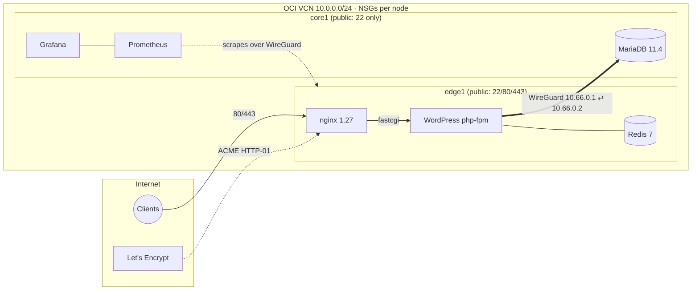

# infra-platform


Ansible-managed two-node infrastructure on Oracle Cloud (ARM64):
a public **edge** node serving web workloads and an internal **core** node
serving the database, connected by an encrypted WireGuard overlay. A bare
Ubuntu instance becomes a fully configured node — hardened SSH, default-drop
firewall, Docker runtime, application stacks, TLS certificates, scheduled
maintenance — in a single playbook run.

Everything is code: playbook runs are idempotent, and manual changes
are treated as drift to be erased by the next run.

## Architecture



Two firewall layers, independently default-deny:

| Layer | Mechanism | edge1 | core1 |
|---|---|---|---|
| Cloud | OCI Network Security Groups | 22, 80, 443 public; 51820/udp from core's NSG | 22 public; 51820/udp from edge's NSG |
| Host | nftables (input **and** forward drop by default) | + 80/443 in FORWARD (container DNAT) | tunnel + established only |

All internal traffic — database and monitoring today; backups next — use
the WireGuard tunnel and binds exclusively to `10.66.0.x` addresses. Nothing
internal is reachable from the public network.

## Design decisions

**Container port bindings are always explicit.** Every published port in a
compose file states its bind address (`127.0.0.1`, a tunnel address, or
`0.0.0.0`) — bare `port:port` mappings are forbidden, because Compose fills
in `0.0.0.0` itself rather than deferring to the daemon's default bind
address. Docker's `daemon.json` still sets `"ip": "127.0.0.1"` as a backstop
for anything started outside compose.

**Host firewall covers FORWARD and INPUT.** Traffic to published
container ports is DNAT'd and traverses the FORWARD chain; a firewall that
only filters INPUT does not filter containers. The nftables ruleset drops
both chains by default and opens 80/443 in FORWARD on the edge only.

**Firewall changes have auto rollback.** The nftables role starts a
`systemd-run` timer that flushes the ruleset after 3 minutes, applies
the new rules, re-establishes a fresh SSH connection to prove reachability,
and only then stops the timer.

**Service lifecycles are declared in systemd.**
`docker.service` carries two drop-ins: `After=/Wants=wg-quick@wg0` (containers
bind to tunnel addresses, so the tunnel must exist first) and
`PartOf=nftables.service` (an nftables restart flushes Docker's NAT rules;
PartOf restarts Docker automatically so DNAT is rebuilt without intervention).

**Databases get time to shut down.** Docker's default 10-second
SIGTERM→SIGKILL window is too short for a database mid-flush. The daemon's
`shutdown-timeout` is raised to 60s and MariaDB's `stop_grace_period` to 1m,
so daemon restarts (which the PartOf binding makes routine) never kill the
DB uncleanly.

**TLS between nodes is delegated to WireGuard.** MariaDB is reached with TLS
verification disabled *inside the tunnel*: the transport is already
authenticated and encrypted end-to-end by WireGuard, and a self-signed
database certificate would add verification failures without adding security.

**Certificate domains are configuration.** The web role compares the SANs of
the live certificate against the declared `web_cert_domains` list and invokes
certbot only on mismatch. Adding a subdomain is a one-line variable change;
steady-state runs never contact Let's Encrypt. On a bare node the role
bootstraps in order — HTTP-only vhosts, ACME issuance, re-render with TLS —
so a fresh instance reaches HTTPS in the same single run. Renewal timing is
owned separately by a systemd timer (twice daily, randomized, `Persistent=`).

**Application provisioning is headless.** WordPress is installed by `wp-cli`
(a compose `tools` profile, like certbot) during the playbook run, with the
admin password from Ansible Vault. The public `install.php` window is
reduced to the seconds between stack start and the install task; no browser
setup step exists. The Redis object cache plugin is installed and enabled the
same way, gated on the presence of its drop-in file for idempotence.

**Updates are automated on two clocks.** WordPress core and plugins
self-update via WP's own mechanism, driven by a real systemd timer running
`wp cron` every 15 minutes (php-fpm's visit-triggered pseudo-cron is disabled).
Container images track their pinned major/minor tags via `pull: always`,
making every playbook run the image-update channel with changes visible
in the run recap. The metrics exporters pin exact versions and update 
by pull request instead.

**Monitoring is tunnel-only and provisioned as code.** Prometheus and Grafana
run on the private core node, host-networked and bound to the WireGuard address; 
observability images pin exact versions and update by pull request. No firewall
ports were added: scrapes leave core over the tunnel and return as established
traffic, and admin access is an SSH port-forward. Grafana is provisioned
entirely from the repository.

**Secrets never leave the vault layer.** All credentials live in an encrypted
`group_vars/all/vault.yml`; templates reference intermediate variables, never
`vault_*` names directly. Compose files that embed secrets are deployed mode
`0600` with `diff: false`. The real inventory (IPs, key paths) is gitignored;
`inventory.example.yml` documents its shape.

**The pipeline is the deployment path.** Every push and pull request runs
`ansible-lint --strict`, and the full playbook deploys from a GitHub-hosted
runner. The runner holds no standing state — a dedicated deploy SSH key,
the vault password, and the real inventory are injected from repository
secrets at runtime.

## Repository layout

```
.github/workflows/       # CI: lint on push/PR · CD: deploy on dispatch
site.yml                 # base → firewall (serial) → runtime → db (core) → web (edge)
inventory.example.yml    # sanitized inventory shape; real inventory is gitignored
requirements.yml         # Ansible collections
requirements.txt         # Python toolchain (ansible, ansible-lint)
group_vars/
  all/                   # domain, WG public keys, encrypted vault
  core/  edge/           # per-group service variables
host_vars/               # per-node WireGuard addressing
roles/
  bootstrap/             # packages, hostname, timezone, unattended upgrades
  ssh/                   # hardening drop-in (key-only, validated before reload)
  wireguard/             # wg0 tunnel from vaulted keys
  nftables/              # default-drop ruleset with self-reverting rollout
  docker/                # engine (deb822 repo), daemon.json, systemd drop-ins
  exporters/             # exporters for monitoring stack
  mariadb/               # DB stack on core, tunnel-only binding
  monitoring/            # Prometheus + Grafana
  web/                   # nginx + WordPress + Redis, declarative TLS, timers
```

## Quickstart

Requires two Ubuntu 24.04 hosts reachable over SSH and a domain with A
records pointing at the edge node's public IP.

```bash
python3 -m venv .venv_ansible && source .venv_ansible/bin/activate
pip install -r requirements.txt
ansible-galaxy collection install -r requirements.yml

cp inventory.example.yml inventory.yml       # change IPs and key paths

# Create your own vault:
echo 'your-vault-passphrase' > .ansible-vault-pass-infra   # gitignored
ansible-vault create group_vars/all/vault.yml
```

The vault must define: `vault_wg_private_key_edge`,
`vault_wg_private_key_core` (from `wg genkey`; put the matching public keys
in `group_vars/all/vars.yml`), `vault_mariadb_root_password`,
`vault_mariadb_wp_password`, `vault_wordpress_admin_password`. Set `domain`,
`certbot_email`, and `web_cert_domains` for your environment.

```bash
ansible-lint            # lints clean
ansible-playbook site.yml
ansible-playbook site.yml # idempotence check: expect no changes except fallback
```

## Verification

Run after any significant change:

```bash
ssh edge1 'sudo wg show wg0'                     # handshake < ~30s
ssh edge1 'ping -c 3 10.66.0.2'                  # tunnel path
curl -I https://<domain>                         # HTTP/2 200, Let's Encrypt cert
curl -I http://<domain>                          # 301 → https
curl -I https://blog.<domain>                    # 200 (WordPress, DB over tunnel)
ssh edge1 'cd /opt/stacks/web && sudo docker compose run --rm -T \
  wpcli wp core is-installed && echo ok'         # checks the container→DB path
ssh edge1 'sudo docker exec redis redis-cli info keyspace'   # object cache populated
ssh edge1 'systemctl list-timers | grep -E "certbot|wp-cron"'
```

The firewall/runtime integration test — restart the firewall and confirm
the public ports return without manual intervention:

```bash
ssh edge1 'sudo systemctl restart nftables' && sleep 30 && curl -I https://<domain>
```
